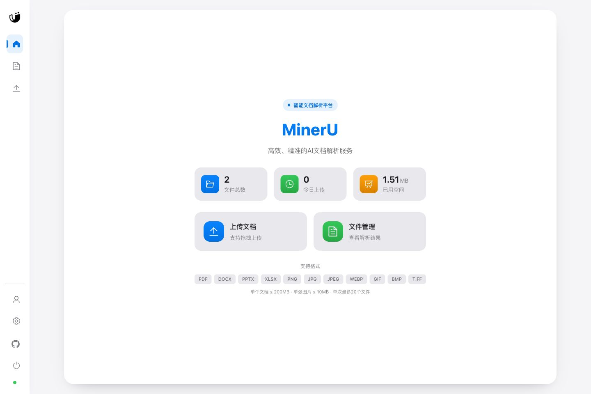
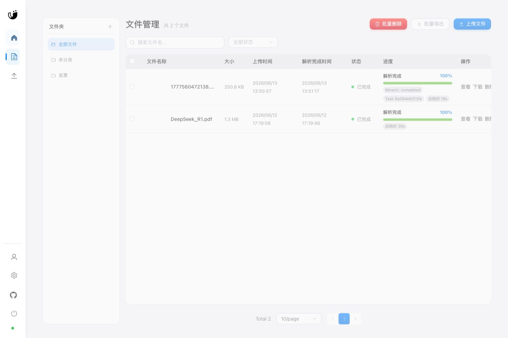
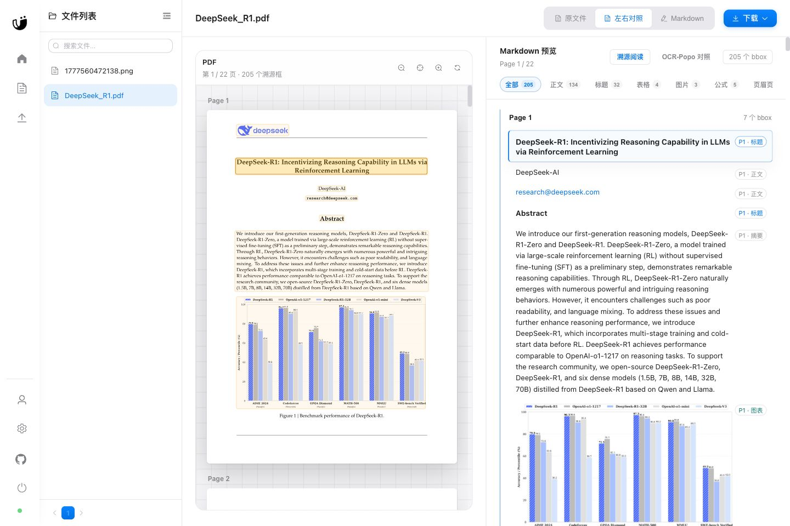
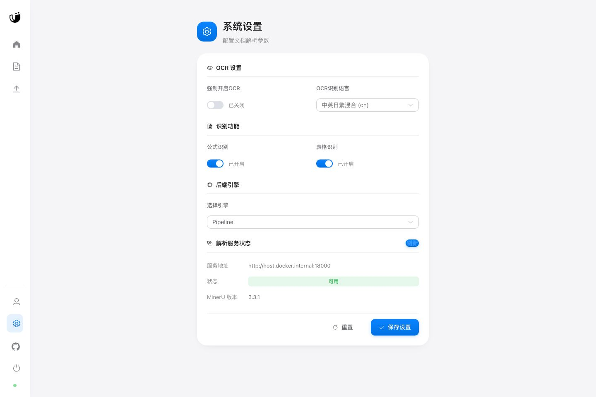

# MinerU Web

MinerU Web 是一个面向文档解析的 Web 应用，提供文件上传、异步解析、解析结果预览、Markdown 导出和原文件预览能力。当前版本适配 MinerU 3.2.3，业务后端通过官方 MinerU HTTP 服务解析文件，不再直接依赖 MinerU 内部 Python API。

## 特性

- FastAPI + Vue 3 前后端分离
- Redis 队列异步解析
- MinIO/S3 存储原文件、Markdown 和图片资源
- 解析服务状态检测
- 支持 MinerU 3.2.3 官方 backend 选项
- 业务 backend / worker / frontend 可构建多架构镜像
- Linux 服务器部署使用 `mineru-router`，适合多 GPU 环境统一调度
- macOS Apple Silicon 可在宿主机启动 MinerU API，Docker 只运行业务服务

## 快速开始

准备环境变量：

```bash
cp .env.example .env
```

编辑 `.env`，设置一个浏览器和容器都能访问的 MinIO 地址，例如：

```bash
MINIO_ENDPOINT=SERVER_IP:9000
WORKER_REPLICAS=1
WORKER_CONCURRENCY=1
```

Linux 服务器、macOS Apple Silicon、模型下载、MinerU Router、多 GPU、MinIO 地址和验证命令见：[部署文档](docs/deployment.md)。

## 界面展示

<div align="center">
  
  <p>首页 - 展示系统概览和快速操作</p>

  
  <p>文件管理 - 支持多种文档格式的上传和管理</p>

  
  <p>文档预览 - 智能解析和展示文档内容</p>

  
  <p>系统设置 - 后端选择与解析服务状态</p>
</div>

## 项目结构

```text
mineru-web/
├── backend/                  # FastAPI 后端、worker、数据库模型和测试
├── frontend/                 # Vue 3 前端
├── docs/
│   └── deployment.md         # 部署说明
├── docker-compose.yml        # Linux / 服务器部署
├── docker-compose.mac.yml    # macOS 宿主机 MinerU API 部署
└── README.md
```

## 配置

常用环境变量见 [.env.example](.env.example)，完整说明见：[部署文档](docs/deployment.md#环境变量)。

## 测试

验证命令见：[部署文档](docs/deployment.md#验证命令)。

## 更新日志

### 3.2.3

- 适配 MinerU 3.2.3 官方 HTTP API
- 解析入口切换到 sidecar / router 模式
- 保留 MinIO/S3 图片与 Markdown 转存能力
- 业务 backend / worker 移除 MinerU 内部依赖
- 设置页增加解析服务状态展示
- backend 类型适配官方 3.2.3 backend 参数

## 开源协议

本项目采用 AGPL-3.0 协议开源，详情参见 [LICENSE](LICENSE)。

## 致谢

- [MinerU](https://github.com/opendatalab/MinerU)
- [FastAPI](https://github.com/fastapi/fastapi)
- [Vue](https://github.com/vuejs/core)
